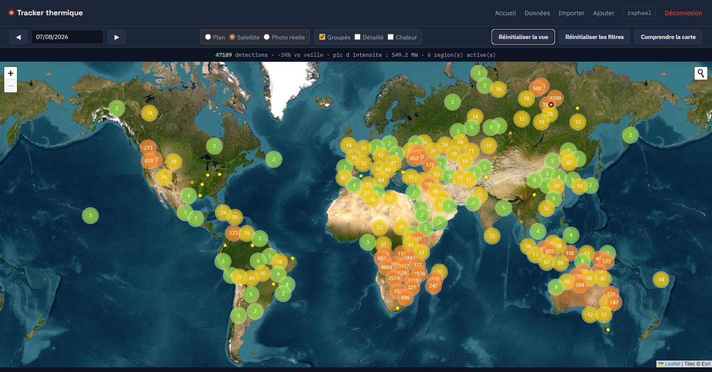
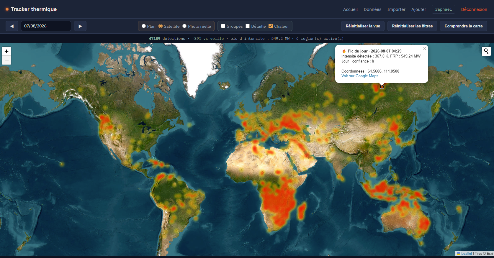
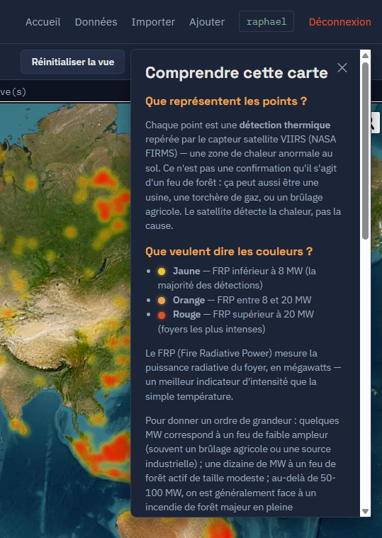
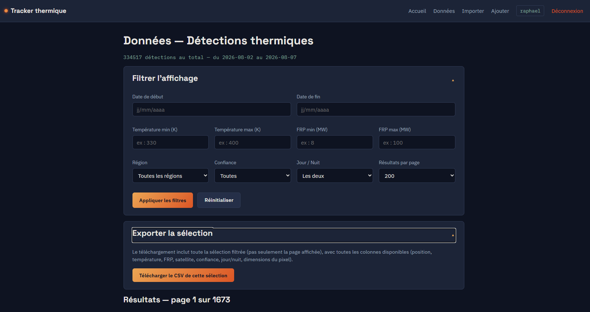
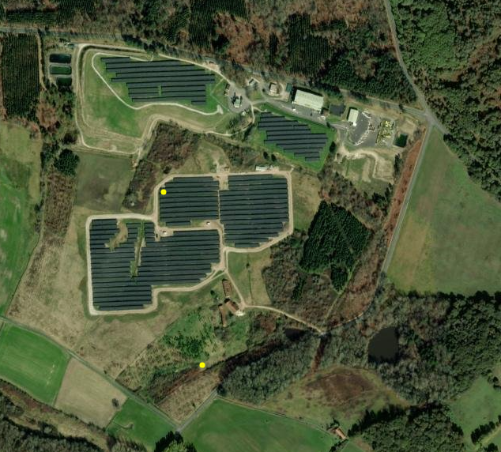

# Tracker thermique par satellite


%20%2F%203.7%20(prod)-blue>)
%20%2F%202.2%20(prod)-black>)

**Site en ligne :** [navarroraphael.fr/projets/tracker](https://navarroraphael.fr/projets/tracker/)

## English summary

A Flask web application that tracks satellite thermal detections worldwide, using NASA FIRMS (VIIRS) open data. **Live at [navarroraphael.fr/projets/tracker](https://navarroraphael.fr/projets/tracker/)**, running on shared hosting with a daily automated import (Cron). Features an interactive map (clusters, heatmap, true-color satellite imagery via NASA GIBS), a filterable scientific data page with CSV export, and daily/historical import tools. Built as a learning project to move from PHP/Symfony toward Python/Flask, developed with heavy AI-assisted pair-programming (Claude) — see the _Approche de développement_ section below for an honest account of what was autonomous vs. assisted. **Important:** this tool detects thermal anomalies, not confirmed wildfires — see _Limites connues_.

---

## À propos

Application web Flask qui centralise et visualise les détections thermiques repérées par satellite dans le monde entier, à partir des données ouvertes **NASA FIRMS** (capteur VIIRS). Le projet propose une carte interactive riche, une page de données scientifiques filtrables avec export CSV, et des outils d'import (quotidien et historique).

Ce projet est né d'un test d'apprentissage Python/Flask (dans la continuité d'un parcours PHP/Symfony) et a progressivement grandi en un vrai outil complet — voir la section _Historique du projet_ pour le contexte.

## Fonctionnalités

**Carte interactive** (`/`)

- Trois vues : points groupés (clusters), points détaillés, carte de chaleur (densité cumulée)
- Fonds de carte : plan, imagerie satellite (Esri), photo satellite réelle en couleurs naturelles (NASA GIBS)
- Navigation jour par jour avec calendrier, recherche de lieu
- KPI du jour (total, tendance, pic d'intensité, régions actives) avec repérage visuel du foyer le plus intense
- Panneau d'aide intégré expliquant la lecture des données

**Page données** (`/donnees`)

- Filtres scientifiques complets : période, température, FRP (puissance radiative), confiance de détection, jour/nuit, région
- Pagination, export CSV de la sélection filtrée avec toutes les colonnes (position, satellite, dimensions du pixel, etc.)

**Administration** (connexion requise)

- Import manuel depuis FIRMS (zone mondiale, jusqu'à 5 jours de couverture), ou automatique quotidien
- Scripts d'import historique et de maintenance (`scripts/`), avec bascule automatique entre données archivées (SP) et temps réel (NRT)
- CRUD complet sur les événements

## Stack technique

- **Backend** : Python, Flask, SQLAlchemy, Flask-Login, Flask-WTF, Flask-Limiter
- **Base de données** : SQLite (développement) / MySQL 8.4 (production)
- **Frontend** : Jinja2, CSS natif (design system maison), Leaflet.js (cartographie), Flatpickr (calendrier)
- **Données** : [NASA FIRMS](https://firms.modaps.eosdis.nasa.gov/) (VIIRS NOAA-20), [NASA GIBS](https://wiki.earthdata.nasa.gov/display/GIBS) (imagerie satellite)
- **Déploiement** : hébergement mutualisé OVH, CGI (pas de support WSGI natif sur cette offre), import quotidien automatisé par tâche planifiée (Cron)

Le détail des contraintes de production (versions figées, dépendances incompatibles, réseau) est documenté dans [`PROJECT.md`](./PROJECT.md).

## Limites connues (important)

Ce tracker affiche des **détections thermiques**, pas des incendies confirmés. Une détection peut correspondre à :

- un feu de forêt ou de végétation
- une installation industrielle, une torchère de gaz
- un brûlage agricole
- plus rarement, un faux positif (réflexion solaire, etc.)

Autres limites à connaître :

- **Résolution variable** : chaque détection correspond à un pixel satellite d'environ 375 m, mais sa taille réelle varie selon la position dans le passage du satellite (effet "bowtie")
- **Couverture temporelle partielle** : le satellite ne repasse que 1 à 2 fois par jour au-dessus d'un point donné — un import ponctuel peut manquer des événements
- **Carte de chaleur** : une zone rouge peut représenter un seul foyer intense ou de nombreux petits foyers proches (ex. brûlage agricole en Afrique) — la densité cumulée ne distingue pas les deux cas
- **Photo satellite réelle (GIBS)** : résolution limitée à un niveau de zoom modéré, et parfois des zones sans image (le satellite ne couvre pas systématiquement toute la planète chaque jour)

## Captures d'écran

**Vue d'ensemble mondiale, points groupés**


**Carte de chaleur avec détail du pic du jour**


**Panneau d'aide intégré**


**Page données : filtres scientifiques et export CSV**


**Exemple de limite documentée : détection sur une centrale solaire**

Une détection thermique repérée sur des panneaux photovoltaïques (pas un incendie) — illustre concrètement pourquoi ce tracker affiche des _détections thermiques_, pas des _incendies confirmés_, et pourquoi la position d'un point peut sembler légèrement décalée par rapport à la source réelle visible en imagerie (résolution native du capteur ≈375m).



## Sécurité

- Authentification requise pour toute action d'administration (import, ajout, modification, suppression)
- Protection CSRF sur tous les formulaires (Flask-WTF)
- Limitation des tentatives de connexion (5 par minute et par IP)
- Mode debug désactivé par défaut, activable uniquement via variable d'environnement (`FLASK_DEBUG`)
- Clés et secrets exclusivement en variables d'environnement, jamais versionnés

## Statut et déploiement

**En ligne depuis août 2026** sur un hébergement mutualisé OVH (hosting-pro). L'import quotidien des détections est entièrement automatisé (tâche Cron), avec une purge automatique des données de plus de 180 jours pour rester dans le quota de stockage disponible. Voir [`PROJECT.md`](./PROJECT.md) pour le détail des décisions d'architecture et des contraintes découvertes en cours de déploiement.

## Installation

```bash
git clone https://github.com/raphael25200/tracker-thermique.git
cd tracker-thermique
python -m venv venv
venv\Scripts\Activate.ps1   # Windows
pip install -r requirements.txt
```

Copier `.env.example` en `.env` et renseigner :

- `FIRMS_API_KEY` — clé gratuite sur [firms.modaps.eosdis.nasa.gov/api](https://firms.modaps.eosdis.nasa.gov/api/)
- `SECRET_KEY` — générer avec `python -c "import secrets; print(secrets.token_hex(32))"`
- `DATABASE_URL` — optionnel, URL MySQL pour la production (par défaut : SQLite en local)
- `FLASK_DEBUG` — optionnel, `True` en développement uniquement

```bash
python app.py
```

## Historique du projet

Démarré comme mini-projet d'apprentissage Python/Flask (dans la continuité d'un parcours PHP/Symfony), avec pour objectif initial de tester la stack sur quelques jours. Le projet s'est étoffé progressivement : première source de données (GDELT, abandonnée pour cause de limitation de débit trop agressive — voir `archives/`), bascule vers NASA FIRMS, puis ajout de la carte interactive, de l'import historique et des outils d'analyse.

## Approche de développement

Ce projet a été développé en pair-programming avec assistance IA (Claude, Anthropic) — génération de code guidée, avec explications systématiques à chaque étape et débogage actif (lecture de tracebacks, compréhension des erreurs, décisions d'architecture). Ce n'est pas un projet Python entièrement autonome comme [hydro-observatoire](https://github.com/raphael25200/hydro-observatoire), mais ça va au-delà du simple prompt engineering : la compréhension du code produit et les choix techniques (sources de données, structure de la base, compromis performance/précision) sont miens.

## Auteur

Raphaël Navarro — [GitHub](https://github.com/raphael25200) · [LinkedIn](https://www.linkedin.com/in/navarroraphael/)
